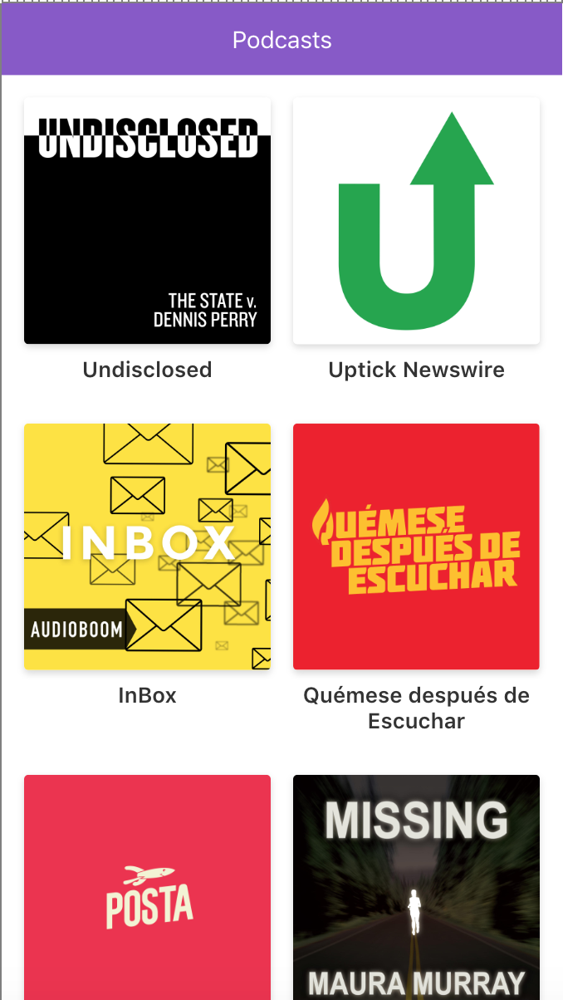

# App de Podcasts
App de podcasts integrada con la API de AudioBoom
para aprender Nextjs.

## Pasos para desplegar

Requiere Nodejs 10

* `npm install` para instalar las dependencias.
* `npm run dev` para el entorno de desarrollo.
* `npm run build && npm start` para el entorno de producción.

## Licencia

MIT
